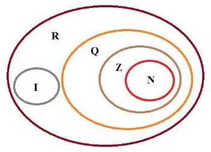

# Big Number - Simple Library

## 📄 Overview:
This simple library aims to be able to perform the four basic mathematical operations (addition, subtraction, multiplication, and division) involving numbers with many digits.

## 💡 Operations:
This library presents the implementation of the four basic mathematical operations for integers.
1. Addition with Carrying: Receives a number A and a number B and performs the digit-by-digit addition.
2. Subtraction with Borrowing: Receives a number A and a number B and performs the digit-by-digit subtraction.
3. Multiplication of Partial Products: Receives a number A and a number B and performs the multiplication.
4. Euclidean Division: Receives a number A and a number B and performs the division.

## 🤔 How To Use:
When you run the code, it will request two files. The first file is the input file, and the second file is the output file.

```
Enter the input file: ../test/operation_sum_input/op1.txt
Enter the output file: ../test/operation_sum_output/op1.txt
```

The input file must follow a specific format, which is described below:
1. Digits of Number A.
2. Digits of Number B.
3. Operator (+, -, *, /).

```
2222
22
+
```

After this information is entered, the response will be displayed in the output file.

## 🎯 Numeric Set: Z
This library operates exclusively on integers.



## 🔐 Digit Limit:
This library uses "long int" to store the number of elements in a number. Therefore, it is possible to perform operations with numbers that have up to 2,147,483,647 digits.


